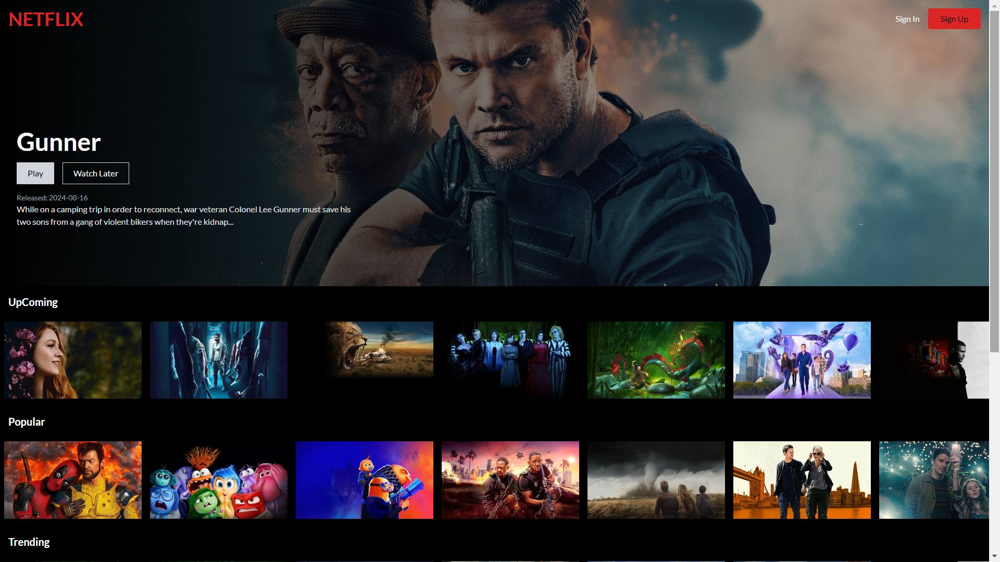

# 🚀 Netflix like website




This project is a front-end Netflix like website with a Firebase back-end. It uses the TMDB API to fetch movie and TV show data
and Firebase Authentication to manage user logins. The app is styled with Tailwind CSS and deployed using Firebase
Hosting.

## 💻 Features

- **User Authentication**: Secure login and signup functionality powered by Firebase Authentication.
- **Movie Data**: Fetches real-time movie and TV show data from the TMDB API.
- **User-Specific Data**: Users can save their favorite movies and shows, with data stored in Firestore (Firebase's
  cloud storage).
- **Responsive Design**: Styled using Tailwind CSS for a sleek, responsive user interface.

## 🛠️ Technologies Used

- **React**: For building the user interface.
- **Vite**: As the build tool for a faster and leaner development experience.
- **Next.js**: For server-side rendering and static site generation (optional).
- **Firebase**: For back-end services including Authentication, Firestore, and Hosting.
- **TMDB API**: To source movie and TV show data.
- **Tailwind CSS**: For efficient and modern styling.

## Installation

1. **Clone the repository:**

   ```bash
   git clone https://github.com/Zsombinszky/netflix-clone.git
   cd netflix-clone

2. **Install dependencies:**

```bash
npm install
```

3. **Create a .env file in the root directory with your Firebase and TMDB API credentials:**

```env
VITE_APP_FIREBASE_API_KEY=
VITE_APP_FIREBASE_AUTH_DOMAIN=
VITE_APP_FIREBASE_PROJECT_ID=
VITE_APP_FIREBASE_STORAGE_BUCKET=
VITE_APP_FIREBASE_MESSAGING_SENDER=
VITE_APP_FIREBASE_APP_ID=
```

4. **Start the development server:**

```bash
npm run dev
```

5. **Deploy to Firebase Hosting (optional):**

```bash
npm run build
firebase deploy
```

## Usage
- **Sign Up/Login:** Create an account or log in using Firebase Authentication.
- **Browse Content:** View movies and TV shows fetched from the TMDB API.
- **Save Favorites:** Save your favorite movies and shows to your account, with data stored in Firestore.
  - **Responsive Interface:** Enjoy a seamless experience across devices, thanks to Tailwind CSS.